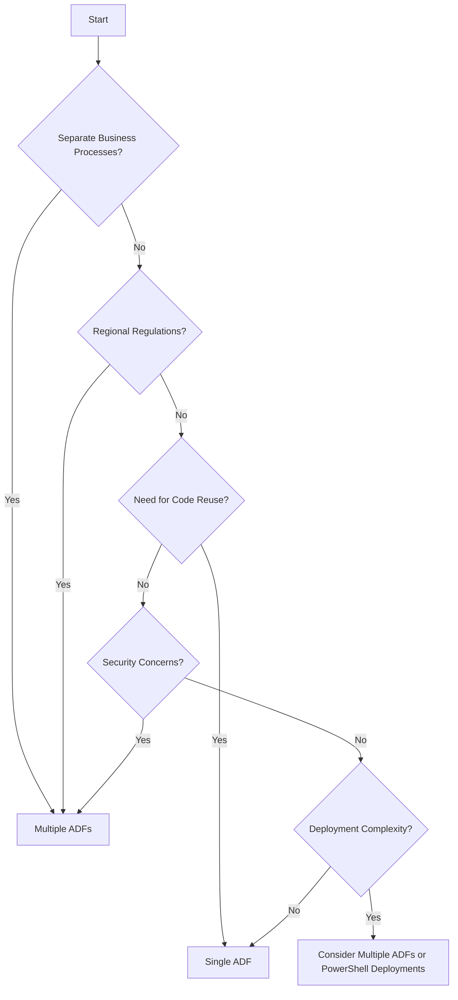

# When Should I Use Multiple Azure Data Factory Instances?

Based on the insights from Paul Andrew's article, "When Should I Use Multiple Azure Data Factory’s?" ([mrpaulandrew.com](https://mrpaulandrew.com/2020/05/22/when-should-i-use-multiple-azure-data-factorys/)), here's a summary and a decision tree to help determine when to deploy multiple Azure Data Factory (ADF) instances.

## Summary

Deciding whether to use multiple ADF instances depends on various organizational and technical factors:

- **Business Processes**: Separating ADF instances can streamline management for distinct departments like Sales, Finance, and HR, each with unique data delivery requirements and schedules.
  - **Questions to Ask**:
    - Do departments operate independently with separate data delivery requirements?
    - Are there distinct schedules and workflows unique to specific departments?
    - Example: Sales requires near real-time reporting, while Finance operates on end-of-month data aggregation.

- **Azure Consumption**: Allocating separate ADF instances per department can simplify inter-departmental billing. However, this might lead to higher overall costs due to missed economies of scale, such as shared Data Flow cluster compute.
  - **Questions to Ask**:
    - Is it important to track Azure costs by department?
    - Does the organization prioritize cost savings over simplified billing?
    - Example: Finance might prefer detailed cost tracking, but sharing a Data Flow cluster reduces expenses.

- **Regional Regulations**: For multinational organizations, data residency laws may necessitate data processing within specific regions. While a single ADF instance can handle this using region-specific Integration Runtimes (IRs), it adds management complexity. Separate ADF instances per region can reduce this overhead.
  - **Questions to Ask**:
    - Are there specific data residency or sovereignty laws in the regions where data is processed?
    - Will managing region-specific Integration Runtimes in a single ADF instance create unnecessary complexity?
    - Example: European operations require data to remain within the EU, while North American operations have no such constraints.

- **Code Reuse**: Maintaining a single ADF instance facilitates code reuse, with shared Linked Services and generic Datasets, simplifying development and deployment.
  - **Questions to Ask**:
    - Can existing pipelines, Linked Services, and Datasets be reused across projects?
    - Does the team have a streamlined way to manage and share code?
    - Example: A central ADF instance with reusable datasets for all departments minimizes duplication.

- **Security (PII Data)**: ADF's access control is limited to the resource level. To restrict access to sensitive data, deploying multiple ADF instances can provide a cleaner security model, ensuring users access only relevant data.
  - **Questions to Ask**:
    - Are there strict security requirements to isolate sensitive data?
    - Do multiple teams need restricted access to their own pipelines and data?
    - Example: HR data with personally identifiable information (PII) requires separate ADF instances to ensure access control.

- **Decoupling Orchestration from Workers**: Separating orchestration pipelines from worker pipelines can enhance modularity and align with organizational structures, especially in global operations.
  - **Questions to Ask**:
    - Are there clear roles and responsibilities between orchestration and data processing teams?
    - Does separating orchestration pipelines align with organizational workflows?
    - Example: A global organization separates high-level orchestration pipelines from region-specific data processing tasks.

- **Deployments**: Managing large ARM templates can be cumbersome. While multiple ADF instances can alleviate this, using PowerShell for component-level deployments offers more control within a single ADF instance.
  - **Questions to Ask**:
    - Are ARM templates becoming difficult to manage due to the size of the ADF instance?
    - Would component-level deployments via PowerShell simplify updates?
    - Example: A single ADF instance can use PowerShell for selective pipeline deployments, avoiding template size limitations.

In summary, the decision to use multiple ADF instances should consider factors like business process separation, cost management, regulatory compliance, code reuse, security requirements, organizational structure, and deployment strategies.

## Decision Tree

This decision tree guides you through key considerations to determine the appropriate number of ADF instances for your organization's needs.
